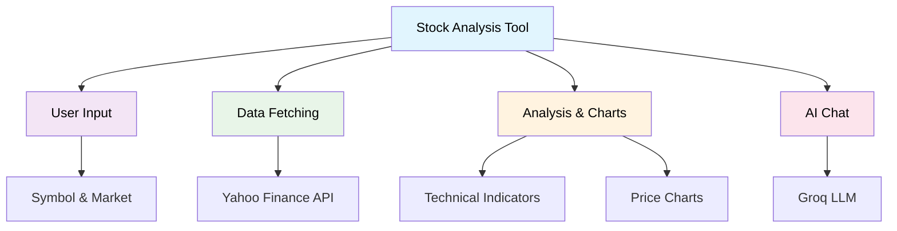

# QuantScope

A Streamlit-based stock analysis application with real-time data, technical indicators, interactive charts, and AI-powered insights for global markets.

## Quick Start

1. **Install dependencies**
   ```bash
   pip install streamlit yfinance plotly python-dotenv langchain-groq langchain pandas numpy
   ```

2. **Set up environment**
   ```bash
   echo "GROQ_API_KEY=your_groq_api_key_here" > .env
   ```

3. **Run the app**
   ```bash
   streamlit run main.py
   ```

## Features

- **Multi-Market Support**: US, Indian, UK, Canada, Australia, Germany, France, Japan, Hong Kong
- **Real-Time Data**: Live stock prices via Yahoo Finance
- **Technical Analysis**: RSI, SMA, Bollinger Bands
- **Interactive Charts**: Price, candlestick, volume, technical indicators
- **AI Chat**: Ask questions about stocks using Groq's Llama model
- **Smart Queries**: Natural language input like "AAPL 3 months"
- **Data Export**: Download as CSV

## Architecture



### Architecture Layers

1. **User Interface Layer**: Streamlit components for user interaction, charts, chat, and session management
2. **Business Logic Layer**: Core StockAnalyzer class handling symbol processing, analysis, and chart generation
3. **Data Processing Layer**: Technical indicators calculation, caching, and data validation
4. **External Services Layer**: Integration with Yahoo Finance, Groq LLM, and Plotly visualization

## Usage Examples

### Basic Analysis
```
Input: "AAPL 6 months"
Output: Apple stock analysis with 6-month historical data
```

### Multi-Market
```
Symbol: RELIANCE
Market: Indian
Period: 1y
Result: Reliance Industries analysis in INR
```

### Supported Markets
| Market | Suffix | Currency | Example |
|--------|--------|----------|---------|
| US | - | $ | AAPL |
| Indian | .NS | ₹ | RELIANCE.NS |
| UK | .L | £ | VODL.L |
| Canada | .TO | C$ | SHOP.TO |

## Technical Indicators

- **RSI**: 14-period Relative Strength Index with overbought/oversold signals
- **SMA**: 20-period and 50-period Simple Moving Averages
- **Bollinger Bands**: 20-period bands with 2 standard deviations

## AI Chat Features

- Technical analysis insights
- Price trend explanations
- Risk assessment guidance
- Context-aware responses using real-time stock data

## Key Dependencies

- streamlit: Web application framework
- yfinance: Yahoo Finance API wrapper
- plotly: Interactive charts
- langchain-groq: Groq LLM integration
- python-dotenv: Environment variable management

## Troubleshooting

**"No data found"**: Check symbol format and market suffix
**"GROQ_API_KEY not found"**: Add API key to `.env` file
**Charts not loading**: Verify internet connection and dependencies

## Disclaimer

This tool is for educational purposes only. Not financial advice. Always consult professionals before investing.

## License

MIT License - see LICENSE file for details.