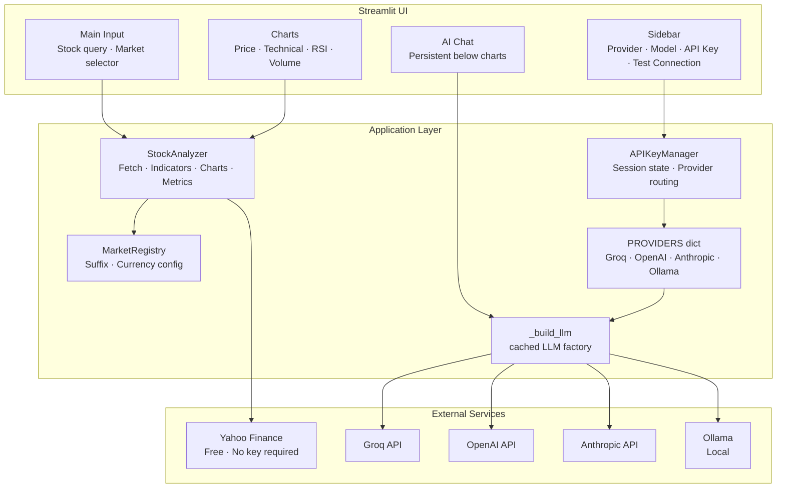

# QuantScope

<div align="center">

[](https://www.python.org/downloads/)
[](https://streamlit.io)
[](https://opensource.org/licenses/MIT)
[](https://github.com/psf/black)

**AI-Powered Stock Analysis Platform — Bring Your Own Key**

A modern Streamlit-based stock analysis application with real-time data, technical indicators, interactive charts, and AI-powered insights using your own API keys.

[Features](#features) • [Quick Start](#quick-start) • [Architecture](#architecture) • [Usage](#usage)

</div>

---

## Overview

QuantScope is a **bring-your-own-key (BYOK)** platform designed for independent traders and analysts. No shared API quotas, no rate limits imposed by the platform — you control your own infrastructure with your API keys.

- **Real-time data** via Yahoo Finance (free, no key required)
- **AI analysis** via your choice of Groq, OpenAI, Anthropic, or Ollama (bring your own key)
- **Multi-market support** across 9 global exchanges
- **Type-safe codebase** with full type hints and modern Python patterns
- **Production-ready logging** and error handling

## Features

- **Multi-Market Support**: US, Indian, UK, Canada, Australia, Germany, France, Japan, Hong Kong
- **Real-Time Data**: Live stock prices via Yahoo Finance API
- **Technical Analysis**: RSI (14), SMA (20/50), Bollinger Bands
- **Interactive Charts**: 
  - Price charts (line & candlestick)
  - Volume analysis
  - Technical indicators overlay
  - RSI signals
- **AI Chat Interface**: Ask questions about stocks using your choice of Groq, OpenAI, Anthropic, or local Ollama models (bring your key)
- **Smart Parsing**: Natural language queries like "AAPL 3 months"
- **Data Export**: Download analysis data as CSV

## Quick Start

### 1. Clone & Setup

```bash
git clone https://github.com/yourusername/QuantScope.git
cd QuantScope
python -m venv venv
source venv/bin/activate  # On Windows: venv\Scripts\activate
pip install -r requirements.txt
```

### 2. Configure API Key

Choose a provider and get your key:
- **Groq** (free tier available): [console.groq.com](https://console.groq.com)
- **OpenAI**: [platform.openai.com/api-keys](https://platform.openai.com/api-keys)
- **Anthropic**: [console.anthropic.com](https://console.anthropic.com/settings/keys)
- **Ollama** (local, no key needed): [ollama.com](https://ollama.com/download)

**Option A: Session Input (Recommended)**
- Run the app: `streamlit run main.py`
- Select provider and enter your API key in the sidebar
- Key stays for the session only

**Option B: Environment Variable**
```bash
cp .env.example .env
# Edit .env and fill in the keys you want to use
streamlit run main.py
```

### 3. Run

```bash
streamlit run main.py
```

The app opens at `http://localhost:8501`

## Architecture


```mermaid
graph TD
    subgraph UI["Streamlit UI"]
        SB[Sidebar\nProvider · Model · API Key · Test Connection]
        IN[Main Input\nStock query · Market selector]
        CH[Charts\nPrice · Technical · RSI · Volume]
        AI[AI Chat\nPersistent below charts]
    end

    subgraph Logic["Application Layer"]
        SA[StockAnalyzer\nFetch · Indicators · Charts · Metrics]
        AK[APIKeyManager\nSession state · Provider routing]
        MR[MarketRegistry\nSuffix · Currency config]
        PR[PROVIDERS dict\nGroq · OpenAI · Anthropic · Ollama]
        BL[_build_llm\ncached LLM factory]
    end

    subgraph External["External Services"]
        YF[Yahoo Finance\nFree · No key required]
        GR[Groq API]
        OA[OpenAI API]
        AN[Anthropic API]
        OL[Ollama\nLocal]
    end

    SB --> AK
    IN --> SA
    SA --> MR
    CH --> SA
    AI --> BL
    AK --> PR
    PR --> BL
    SA --> YF
    BL --> GR
    BL --> OA
    BL --> AN
    BL --> OL
```

### Key Design Decisions

- **MarketRegistry**: Centralized market configuration (no magic strings scattered across the codebase)
- **APIKeyManager**: Session-based key management (secure by default, never stored server-side)
- **PROVIDERS dict**: Single source of truth for all LLM providers, models, and API endpoints
- **`_build_llm()` with `@st.cache_resource`**: LLM instances are cached by (provider, credential, model) tuple — avoids re-initialising on every rerun
- **`_self` in `@st.cache_data`**: Streamlit cannot hash `self`; prefixing with underscore tells the cache to exclude it
- **Type Hints**: Full coverage for IDE support and documentation
- **Caching**: `@st.cache_data(ttl=300)` on stock fetches — 5-minute TTL balances freshness and rate limits

## Usage

### Example Queries

**Natural Language Parsing**
```
Input: "AAPL 6 months"
Output: Apple stock analysis | 6-month period

Input: "RELIANCE"
Output: Reliance Industries | 3-month default
```

**Manual Input**
- Use Advanced Settings to specify exact symbol, market, and period

### Supported Markets & Symbols

| Market | Suffix | Currency | Example |
|--------|--------|----------|---------|
| **US** | (none) | $ | `AAPL` |
| **Indian** | `.NS` | ₹ | `RELIANCE` |
| **UK** | `.L` | £ | `VODL` |
| **Canada** | `.TO` | C$ | `SHOP` |
| **Australia** | `.AX` | A$ | `CBA` |
| **Germany** | `.DE` | € | `SAP` |
| **France** | `.PA` | € | `MC` |
| **Japan** | `.T` | ¥ | `7203` |
| **Hong Kong** | `.HK` | HK$ | `0700` |

### Technical Indicators

- **RSI (14-period)**: Overbought (>70), Neutral (30-70), Oversold (<30)
- **SMA**: 20-period (short-term) and 50-period (mid-term) trends
- **Bollinger Bands**: 20-period with 2 standard deviations

## BYOK Model

QuantScope is designed for users who want complete control over their API usage:

### Why BYOK?
- **No quota limits** imposed by the platform
- **Cost transparency** — you pay only for what you use
- **Data privacy** — your keys, your data
- **Flexibility** — upgrade/downgrade Groq plans independently

### API Key Security
- Keys stored **in-session only** (not persisted to server)
- Optional browser localStorage for convenience (your domain, your storage)
- No server-side key storage
- Clear deletion when session ends

## Development

### Code Standards
- **Type Hints**: Full coverage (`mypy` compatible)
- **Logging**: All major operations logged at INFO level
- **Error Handling**: Graceful degradation with user-friendly messages
- **Docstrings**: Google-style format on all functions and classes

### Testing
```bash
# Lint
black main.py

# Type check
mypy main.py --ignore-missing-imports
```

### Project Structure
```
QuantScope/
├── main.py                 # Application entry point
├── requirements.txt        # Python dependencies
├── .streamlit/
│   └── config.toml        # Streamlit configuration
├── .env.example           # Environment variables template
└── README.md              # This file
```

## Troubleshooting

| Issue | Solution |
|-------|----------|
| "No data found" | Check symbol format and correct market suffix |
| "AI Chat unavailable" | Enter valid Groq API key in sidebar. Get one free at console.groq.com |
| Charts not rendering | Verify internet connection and Plotly installation |
| Slow data fetching | First load caches for 5 minutes. Yahoo Finance may rate-limit. |

## Dependencies

```
Core:
- streamlit        Web app framework
- yfinance         Yahoo Finance API wrapper (free)
- plotly           Interactive charts
- pandas           Data manipulation
- numpy            Numerical computing

AI:
- langchain-groq       Groq integration
- langchain-openai     OpenAI integration
- langchain-anthropic  Anthropic integration
- langchain-ollama     Local Ollama integration
- langchain            LLM orchestration

Configuration:
- python-dotenv    Environment variable management
```

## Disclaimer

**Educational Use Only**. QuantScope is a data and analysis tool, not financial advice. Always conduct independent research and consult qualified financial advisors before making investment decisions.

## License

MIT License — see [LICENSE](LICENSE) file for details.

## Contributing

Contributions welcome! Please:
1. Fork the repository
2. Create a feature branch
3. Submit a pull request with description
4. Ensure code follows black/mypy standards

## Roadmap

- [ ] Watchlist persistence (Streamlit cloud)
- [ ] Portfolio tracking
- [ ] Alert notifications
- [ ] Extended technical indicators (MACD, Stochastic)
- [ ] Options analysis
- [ ] Mobile responsiveness optimization

## Support

- **Issues**: GitHub Issues
- **Documentation**: See [docs/](docs/) folder
- **API Help**: [Groq Console](https://console.groq.com) | [yfinance Docs](https://yfinance.readthedocs.io)

---

<div align="center">

Built by Prajwal Amte

</div>
